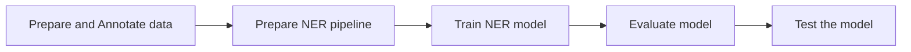

# Train a custom NER model with spaCy

In this workshop you will learn to annotate and prepare text data to train a custom NER model with spaCy. The provided dataset is too small to have good results, however the same approach can be implemented on a larger dataset. The pre-defined entity types (classes or categories) are: `PERSON` and `LOC`.

